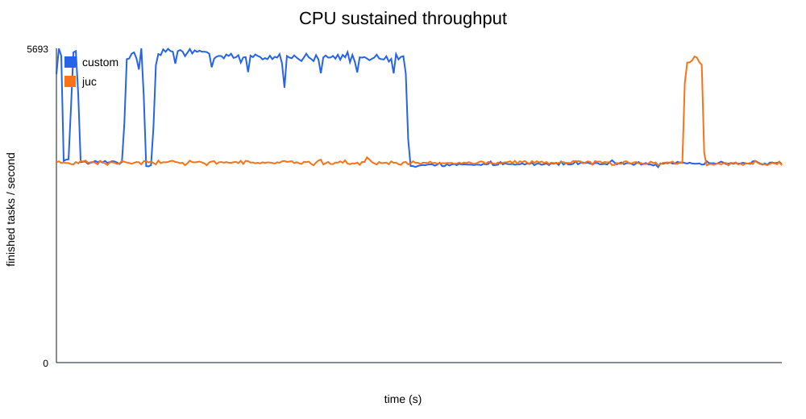
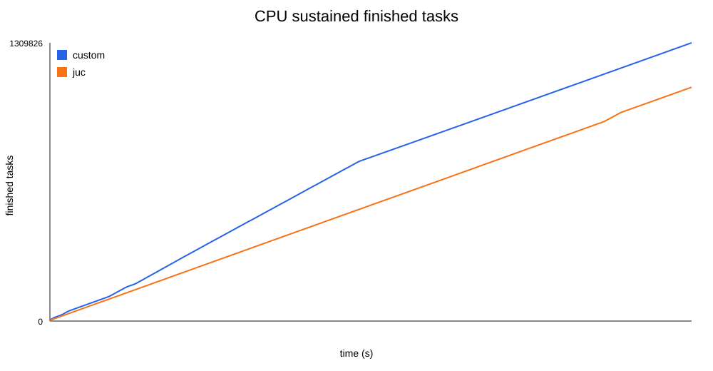
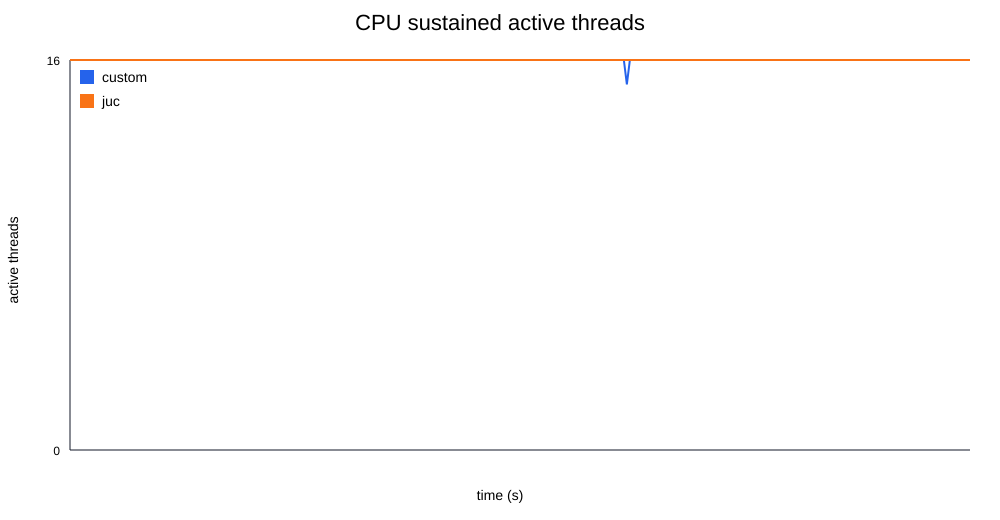
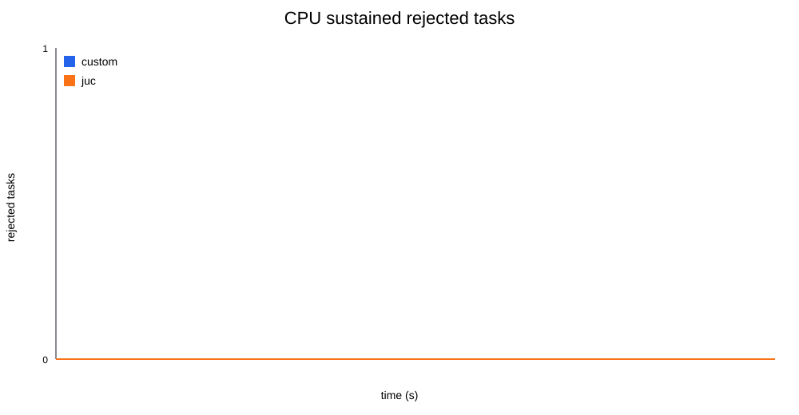

## ThreadPoolExecutorTask

- 支持 `corePoolSize` 和 `maximumPoolSize`
- 支持有界任务队列 `queueCapacity`
- 支持自定义拒绝策略 `RejectPolicy`
- 支持非核心线程空闲超时退出
- 支持 `shutdown()`、`shutdownNow()` 和 `awaitTermination(timeout)`
- 支持统计当前 worker 数量和活跃线程数量
- worker 执行任务时会捕获异常，避免单个任务异常直接杀死 worker

## 运行环境

```text
OS: Microsoft Windows NT 10.0.26200.0
CPU: AMD Ryzen 9 8940HX with Radeon Graphics
CPU物理核心数: 16
CPU逻辑处理器数: 32
JDK: Java 24.0.2
运行方式: IntelliJ IDEA / 本地 JVM
```

## 测试文件说明

```text
Main.java                  功能演示：扩容、拒绝、活跃线程统计、shutdownNow
PressureTest.java          调度边界测试：容量边界、持续提交压力
BenchmarkTest.java         短轮次对比测试：自定义线程池 vs JUC 官方线程池
CpuSustainedBenchmark.java 5分钟 CPU 持续压测：定时采样并输出 CSV
scripts/plot_benchmark.py  根据 CSV 生成折线图
```

## PressureTest：调度边界测试

`PressureTest` 不是严格性能基准测试，主要用于验证线程池调度逻辑：

- `maximumPoolSize` 是否限制最大 worker 数量
- `queueCapacity` 是否限制等待队列长度
- 超出容量后是否触发拒绝策略
- 已接收任务是否能正常执行完成
- `activeCount` 是否能反映当前活跃线程数
- 线程池是否能正常关闭

### 容量边界测试

配置：

```text
corePoolSize = 2
maximumPoolSize = 4
queueCapacity = 100
totalTasks = 1000
taskSleepMillis = 100
```

任务类型：

```text
I/O 等待模拟任务：Thread.sleep(100ms)
```

理论最大接收任务数：

```text
maximumPoolSize + queueCapacity = 4 + 100 = 104
```

理论执行批次数：

```text
ceil(104 / 4) = 26
```

理论执行耗时：

```text
26 * 100ms = 2600ms
```

示例结果：

```text
提交任务数: 1000
理论最大接收任务数: 104
实际接收任务数: 104
提交后 worker 数量: 4
提交后活跃线程数: 4
拒绝任务数: 896
实际开始执行任务数: 104
实际完成任务数: 104
完成 + 拒绝: 1000
线程池是否正常结束: true
已接收任务完成耗时 ms: 2621
```

结论：瞬时提交 1000 个任务时，自定义线程池最多接收 `104` 个任务，其余任务触发拒绝策略，符合容量边界预期。

### 持续压力测试

配置：

```text
corePoolSize = 2
maximumPoolSize = 4
queueCapacity = 100
totalTasks = 300
taskSleepMillis = 50
submitIntervalMillis = 5
```

任务类型：

```text
I/O 等待模拟任务：Thread.sleep(50ms)
```

提交速率约为：

```text
1000 / 5 = 200 tasks/s
```

最大处理能力约为：

```text
maximumPoolSize * 1000 / taskSleepMillis
= 4 * 1000 / 50
= 80 tasks/s
```

说明：这个处理能力是基于 `Thread.sleep(50ms)` 的等待时间估算，用于解释压力来源，不代表 CPU 计算性能。

## BenchmarkTest：与 JUC 官方线程池短轮次对比

`BenchmarkTest` 用相同参数对比自定义线程池和 JUC 官方 `ThreadPoolExecutor`。

通用配置：

```text
corePoolSize = 2
maximumPoolSize = 4
queueCapacity = 100
totalTasks = 1000
rounds = 5
```

### I/O 等待型任务

任务内容：

```text
Thread.sleep(100ms)
```

该测试用于观察等待型任务下，两种线程池在相同参数、相同拒绝条件下的完成数、拒绝数和耗时差异。

### CPU 密集型任务

任务内容：

```java
double value = 0.0;
for (int i = 0; i < loopCount; i++) {
    double x = i * 0.0007;
    value += Math.sin(x) * Math.cos(x) + Math.sqrt(Math.abs(x));
}
blackhole = value;
```

说明：

- 使用 `Math.sin`、`Math.cos`、`Math.sqrt`、`Math.abs` 模拟 CPU 计算任务
- 计算结果写入 `volatile` 变量 `blackhole`，减少 JVM 将计算优化掉的可能
- CPU 密集型耗时会受 CPU 负载、JIT 编译、线程调度影响，短轮次结果可能波动

## CpuSustainedBenchmark：5分钟 CPU 持续压测


默认配置：

```text
CPU: AMD Ryzen 9 8940HX with Radeon Graphics
CPU物理核心数: 16
CPU逻辑处理器数: 32
corePoolSize = 16
maximumPoolSize = 16
queueCapacity = 10000
backlogLimit = 2000
durationSeconds = 300
sampleIntervalMillis = 1000
cpuLoopCount = 200000
```

任务类型：

```text
CPU 密集型任务：Math.sin / Math.cos / Math.sqrt / Math.abs
```

对比对象：

```text
custom: 自定义 ThreadPoolExecutorPractice
juc:    JUC 官方 ThreadPoolExecutor
```

`backlogLimit` 是压测器自己的背压阈值，不是线程池参数。它的作用是让队列持续保持压力，但避免提交线程长时间制造无意义的拒绝任务，从而影响 CPU 吞吐对比。

CPU 密集型压测使用 `corePoolSize = maximumPoolSize = 16`，对应本机 16 个物理核心。这样做的原因是计算密集型任务主要消耗 CPU，线程数超过物理核心后不一定提升吞吐，反而可能增加上下文切换。

运行方式：

```text
运行 com.example.threadpoolexecutortask.CpuSustainedBenchmark
```

默认会压测 300 秒。如果只想快速检查程序能否运行，可以传入秒数，例如：

```text
CpuSustainedBenchmark 5
```

输出文件：

```text
benchmark-results/cpu-sustained.csv
```

CSV 字段：

```text
second       第几秒采样
poolType     custom 或 juc
submitted    累计提交任务数
accepted     累计接收任务数，等于 submitted - rejected
finished     累计完成任务数
rejected     累计拒绝任务数
throughput   当前采样周期内完成的任务数
poolSize     当前 worker 数量
activeCount  当前活跃线程数量
```

## CPU 持续压测折线图

以下图片由 `scripts/plot_benchmark.py` 根据 `benchmark-results/cpu-sustained.csv` 自动生成。

### 每秒完成任务数



### 累计完成任务数



### 活跃线程数



### 拒绝任务数



## 生成折线图

项目提供了 `scripts/plot_benchmark.py`。

如果本机安装了 `matplotlib`，脚本会输出 PNG：

```text
pip install matplotlib
```

如果没有安装 `matplotlib`，脚本会自动退回生成 SVG 图片。

运行：

```text
python scripts/plot_benchmark.py
```

输出图片：

```text
benchmark-results/cpu-throughput.svg
benchmark-results/cpu-finished.svg
benchmark-results/cpu-active-count.svg
benchmark-results/cpu-rejected.svg
benchmark-results/cpu-throughput.png
benchmark-results/cpu-finished.png
benchmark-results/cpu-active-count.png
benchmark-results/cpu-rejected.png
```

SVG 会固定生成并被 README 引用。如果安装了 `matplotlib`，会额外生成 PNG。

图表用途：

- `cpu-throughput.png`：观察每秒完成任务数，比较自定义线程池和 JUC 的吞吐走势
- `cpu-finished.png`：观察累计完成任务数
- `cpu-active-count.png`：观察活跃线程数是否稳定接近 16 个工作线程
- `cpu-rejected.png`：观察持续压力下拒绝任务增长情况

## 结果解释口径

这个项目的压测目标不是证明自定义线程池性能超过 JUC，而是说明：

- 自定义线程池在容量边界、拒绝策略、扩容、关闭、活跃线程统计方面行为正确
- 在相同参数下，可以和 JUC 官方线程池进行可复现的对比
- I/O 等待型任务和 CPU 密集型任务需要分开说明
- 短轮次测试只能看基本行为，5分钟持续压测更适合观察吞吐走势和稳定性
